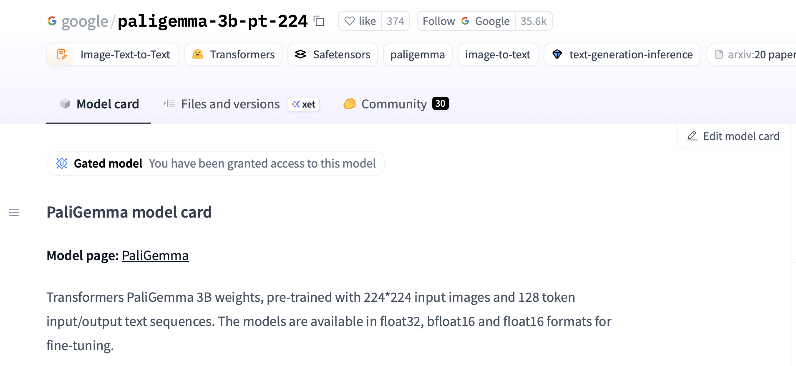
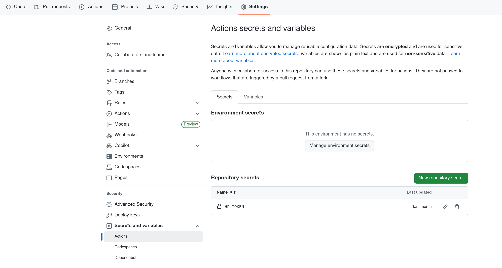

# FAQ

## Common Errors

| Error | Solution |
|-------|----------|
| `OSError: You are trying to access a gated repo` | See [Failing pytest tests due to Hugging Face errors](#failing-pytest-tests-due-to-hugging-face-errors) below. |
| `OSError: Too many open files` when training with S3-hosted data | Run `ulimit -n 65535` (or at least `4096`) before launching training. |
| `raise ReadError("empty file") from None` during training | The number of workers is too high. Reduce `--data.num_workers`. |
| `Unable to locate AWS credentials` | See [Setting up AWS SSO](#setting-up-aws-sso) below. |

---

## Failing pytest tests due to Hugging Face errors

This error usually appears as:

```
FAILED tests/essential/data/test_robotics_dataloader.py::test_batch_size[2]
    - OSError: You are trying to access a gated repo.
```

This is likely caused by not having access to the [PaliGemma](https://huggingface.co/google/paligemma-3b-pt-224) model used in the test cases. Check the following three items:

### 1. HF access

Visit [https://huggingface.co/google/paligemma-3b-pt-224](https://huggingface.co/google/paligemma-3b-pt-224) and click **Accept** to gain access to the PaliGemma model. If successful, the page displays *"You have been granted access to this model"*.



### 2. HF token

Create a Hugging Face token at [https://huggingface.co/settings/tokens](https://huggingface.co/settings/tokens). The token permissions need to be set to **Write**.

Then make the token available locally using either method:

- Place it in `~/.cache/huggingface/token`
- Add `export HF_TOKEN=hf-your-token-here` to your `~/.bashrc`

### 3. HF token on GitHub

When running tests from your own fork, you need to add your `HF_TOKEN` as a GitHub repository secret. In your fork, go to **Settings** > **Secrets and variables** > **Actions** and create a secret called `HF_TOKEN`.



!!! warning
    All three steps are required. Having a valid token is not sufficient if you have not accepted the PaliGemma model access agreement on Hugging Face.

---

## Setting up AWS SSO

If you see `Unable to locate AWS credentials`, you need to configure AWS SSO.

Add the following block to your `~/.aws/config` file:

```ini
[sso-session sso]
sso_region = us-east-1
sso_start_url = https://tri-sso.awsapps.com/start/#
sso_registration_scopes = sso:account:access
output = json
region = us-east-1

[profile manip-cluster]
sso_session = sso
sso_account_id = 682769330988
sso_role_name = Robotics-LBM-PowerUserAccess

[profile sagemaker]
sso_session = sso
sso_account_id = 124224456861
sso_role_name = Robotics-LBM-PowerUserAccess
```

Then log in:

```bash
aws sso login --profile sagemaker --use-device-code
```

!!! tip
    To avoid setting `AWS_PROFILE` every time, add it to your shell configuration:

    ```bash
    # Add to ~/.bashrc or ~/.zshrc
    export AWS_PROFILE=sagemaker
    ```
