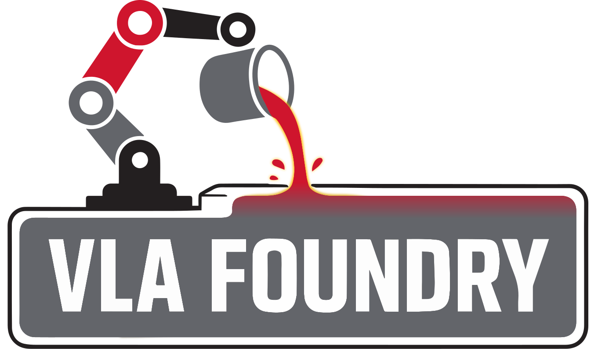

---
hide:
  - navigation
  - toc
---

<div class="hero" markdown>

{ width="600" }

A framework for training **Vision-Language-Action** models.
Train LLMs, VLMs, and VLAs — all in one place with pure PyTorch.

<div class="quick-links" markdown>
[Get Started](getting-started/installation.md){ .md-button }
[Quickstart](getting-started/quickstart.md){ .md-button .secondary }
[GitHub](https://github.com/TRI-ML/vla_foundry){ .md-button .secondary }
</div>

</div>

<div class="feature-grid" markdown>

<div class="feature-card" markdown>
### Multiple Modalities
Train with text, image-captions, or robotics data. Go from LLM to VLM to VLA using the same framework — no external dependencies.
</div>

<div class="feature-card" markdown>
### Multi-Node Training
Built on FSDP2 with WebDataset streaming. Multi-GPU training works locally with `torchrun` and on large clusters with AWS SageMaker.
</div>

<div class="feature-card" markdown>
### Dataset Mixing
Specify dataset sources and ratios at dataloader time for easy dataset mixing and batch balancing across modalities.
</div>

<div class="feature-card" markdown>
### Modular Design
Pure PyTorch implementation with no heavy external libraries. Easy to modify, extend, and add new models or data pipelines.
</div>

<div class="feature-card" markdown>
### Hugging Face Support
Load pretrained weights from Hugging Face for LLMs, VLMs, CLIP models, and more. Use native or HF-backed implementations.
</div>

<div class="feature-card" markdown>
### Registry System
Self-registering models and batch handlers via decorators. Add new architectures without touching core code.
</div>

</div>

---

## Quick Overview

```python
# Train a model
torchrun --nproc_per_node=8 vla_foundry/main.py \
    --model "include vla_foundry/config_presets/models/vlm_3b.yaml" \
    --data.type image_caption \
    --total_train_samples 14_000_000

# Load and use a trained model
from vla_foundry.params.train_experiment_params import load_params_from_yaml
from vla_foundry.models import create_model
from vla_foundry.utils import load_model_checkpoint

model_params = load_params_from_yaml(ModelParams, "path/to/config.yaml")
model = create_model(model_params)
load_model_checkpoint(model, "path/to/checkpoint.pt")
```

## What's Inside

| Section | Description |
|---------|-------------|
| [**Getting Started**](getting-started/installation.md) | Install VLA Foundry and run your first training job |
| [**Concepts**](concepts/architecture.md) | Understand the architecture, config system, and data format |
| [**Guides**](guides/adding-new-models.md) | Step-by-step tutorials for common workflows |
| [**Reference**](reference/params/overview.md) | Detailed parameter and model API reference |
| [**Examples**](examples/index.md) | Annotated training and preprocessing scripts |
